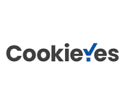
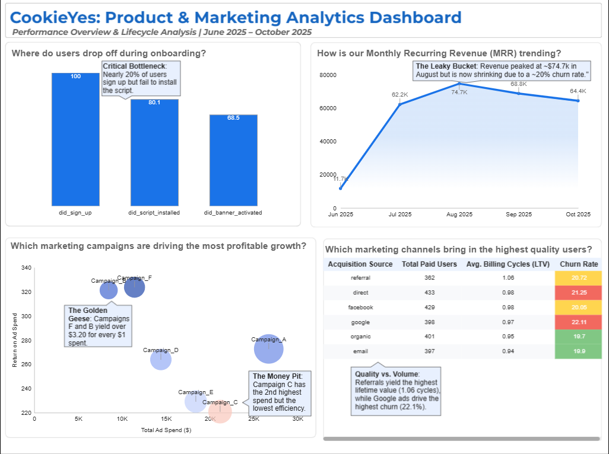
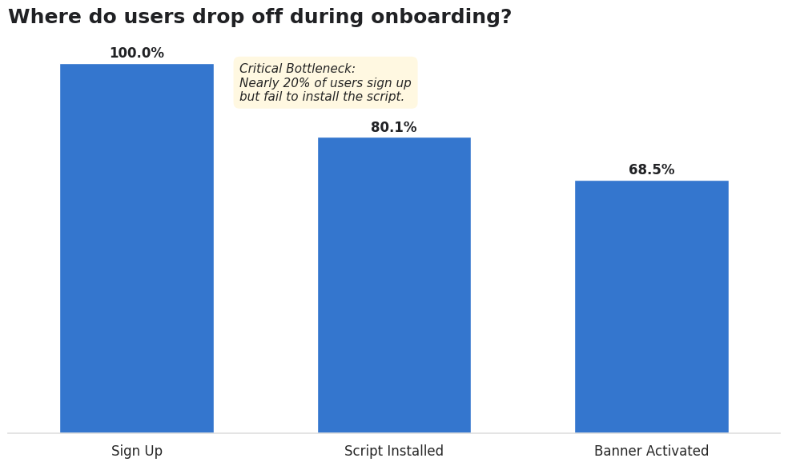
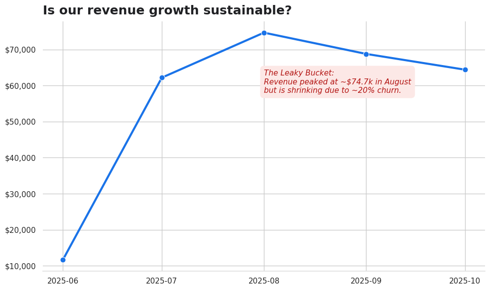
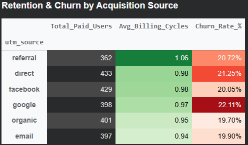
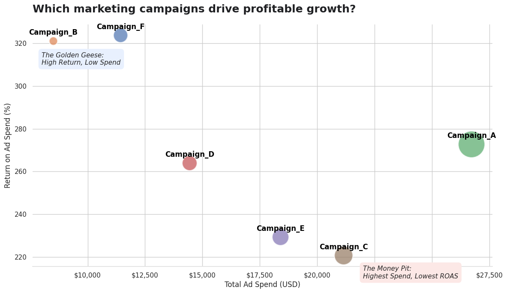

  

<h1 align="center">CookieYes Product & Marketing Analytics</h1>  

  

> *Identifying bottlenecks, optimizing acquisition, and fixing the "leaky bucket" in B2B SaaS.*

> **Product Analytics | Marketing ROI | Python**

This project translates 5 months of historical event telemetry, subscription billing, and marketing data into a targeted strategy to fix a critical revenue leak and optimize marketing spend for a Consent Management Platform.

---

## ⚡ Executive Snapshot

**The Problem:** CookieYes boasts an exceptional Trial-to-Paid conversion rate of **33.8%**, yet Monthly Recurring Revenue (MRR) is actively shrinking after peaking at **~$74.7k** in August. The business is suffering from a "leaky bucket" with an overall churn rate of **20.4%**.

**The Root Cause:** I identified a **"Scan-to-Buy" paradox**. Users are converting to paid plans strictly to view their automated website compliance scan, but nearly **20%** drop off at the technical script installation step. Because they never get the actual banner live, they churn almost immediately. Furthermore, inefficient marketing spend (Campaign C) is bleeding the acquisition budget.

**Strategic Next Steps:**
1.  **Product:** Redesign the script installation flow to eliminate the 20% activation drop-off.
2.  **Monetization:** Introduce a high-margin "One-Time Website Audit" tier to capture value from users who do not want a recurring banner subscription.
3.  **Marketing:** Reallocate budget from Campaign C (lowest ROAS) to Campaign F (yielding $3.24 per $1 spent).

---

## 🏢 Company Background & Business Problem

**CookieYes** is a leading Consent Management Platform (CMP) designed to help Small and Medium-sized Businesses (SMBs) automate their third-party cookie consent to comply with regulations like GDPR and CCPA. The platform offers integration through both a custom Web App and a native WordPress plugin.

**The Business Problem:**
While top-of-funnel acquisition is strong, leadership needs to understand the underlying mechanics of their growth and retention. Specifically, they need to identify:

* Where users are getting stuck in the activation journey.
* If product behavior (e.g., getting the banner live) actually drives revenue.
* Which platforms (Web App vs. WordPress) and acquisition channels drive the highest quality users versus empty volume.
* How to optimize marketing spend to maximize Return on Ad Spend (ROAS).

This analysis translates 5 months of historical event telemetry, subscription billing, and marketing data into a targeted strategy to fix the "leaky bucket" and optimize revenue generation.

---

## 🧠 Structured Analysis

**🔗 [View the Interactive Looker Studio Dashboard Here](https://datastudio.google.com/reporting/9ffa87e1-5538-4fb4-b9ca-32ff89cd7e39/page/mop3F)**

### 1. The User Journey & Activation Bottleneck
*Where do users get stuck, and does the platform matter?*

While CookieYes maintains a healthy overall activation rate (~68.5% of signups eventually get a live banner), the journey is not frictionless. I built a cohort-based funnel to identify the exact moments of drop-off.

* **The Easy Win (97.28%):** Users smoothly transition from sign-up to the automated website scan.
* **The Critical Cliff (80.09%):** The largest bottleneck is the transition from signing up to actually installing the script on their website. Nearly **20% of users fail at this first technical hurdle**.
* **The Hypothesis Buster:** I initially hypothesized that the native WordPress Plugin would activate much higher than the manual Web App. The data proved this wrong: **Web App (68.43%)** and **WordPress (68.52%)** have identical activation rates. Web App users are likely developers who easily navigate the technical friction.

### 2. The "Scan-to-Buy" Paradox
*Does activating the product actually drive revenue?*

CookieYes boasts a world-class Trial-to-Paid conversion rate of **33.81%**. However, correlating product behavior to billing data uncovered a massive SaaS paradox: **Product activation does not drive purchase decisions.**

* **The Setup Decoupling:** Users who successfully got their banner live converted at **33.82%**. Astoundingly, users who completely failed to activate their banner converted at **33.80%**. 
* **The Behavioral Insight:** Users are deciding to pay *before* they figure out how to get the product working. They are signing up, viewing their automated compliance audit (which reveals non-compliant cookies), and immediately upgrading to fix it. 

### 3. The "Leaky Bucket" Retention Threat
*How does product behavior impact Monthly Recurring Revenue (MRR)?*

While the "Scan-to-Buy" behavior drives excellent short-term conversion, it creates severe long-term financial instability. 

* **The Churn Reality:** I identified **716 users** who paid for a subscription but never successfully installed the banner. Because they use CookieYes as a one-time "audit tool" rather than an ongoing consent platform, they churn immediately.
* **The Revenue Impact:** Overall churn sits at a dangerously high **20.4%**. This actively neutralized the massive acquisition boom in August, causing MRR to actively shrink in September and October despite consistent marketing spend. 

### 4. Acquisition Quality & Marketing Efficiency
*Which segments and campaigns are actually profitable?*

Not all volume is good volume. I joined ad performance data, acquisition sources, and invoice revenue to find the true Return on Ad Spend (ROAS).

* **Highest Quality (Referrals):** Referral traffic yields the highest Lifetime Value (LTV of 1.06 billing cycles) and relatively low churn.
* **Lowest Quality (Google):** Google Ads drive massive volume but the lowest quality users, suffering from the highest overall churn rate (**22.11%**). 

* **The Golden Goose (Campaign F):** Campaign F is highly efficient, boasting a low Customer Acquisition Cost (CAC) of $49.94 and yielding **$3.24 for every $1 spent** (323.76% ROAS).
* **The Money Pit (Campaign C):** Campaign C has the highest overall spend but the lowest efficiency, yielding only **$2.21 per $1 spent** with a CAC of $66.94.

---

## 🚀 Strategic Recommendations & Experiments

Based on the funnel drop-offs and the "Scan-to-Buy" behavior, I recommend shifting CookieYes's strategy from pure acquisition to **activation enforcement and intent-based monetization**.

### Recommendation 1: Redesign the Script Installation Flow
The data proves that ~20% of users drop off exactly at the script installation step. The product team must eliminate this technical friction.
* **What to Test:** A/B test a new, interactive in-app setup wizard (or direct integration flow) against the current manual copy/paste method.
* **Metrics to Track:** `script_installed` completion rate, average time from `sign_up` to `script_installed`.
* **Expected Outcome:** A 10-15% relative increase in script installations, directly widening the bottom of the funnel.

### Recommendation 2: Monetize the "One-and-Done" Audit
Currently, users who only want to see their website's compliance report are forced to buy a recurring subscription, leading to guaranteed churn. We should monetize this intent directly.
* **What to Test:** Introduce a high-margin "One-Time Website Audit" pricing tier. Offer this as a down-sell when un-activated users attempt to cancel their subscription.
* **Metrics to Track:** Cancellation deflection rate, One-Time Revenue vs. Lost MRR.
* **Expected Outcome:** Salvage revenue from the 20% churning cohort, turning negative churn metrics into positive one-time cash flow.

### Recommendation 3: Aggressively Reallocate Marketing Budget
Every campaign is profitable, but the efficiency variance is massive.
* **What to Test:** Immediately shift 20-30% of the budget from Campaign C (highest spend, lowest efficiency) to Campaigns F and B (highest ROAS, lowest CAC).
* **Metrics to Track:** Blended Customer Acquisition Cost (CAC), overall Return on Ad Spend (ROAS), Total Net Revenue.
* **Expected Outcome:** A lower blended CAC and a measurable increase in Total Net Revenue without increasing the overall marketing budget.

---

## 🛠️ Technical Methodology & Stack

**The Tech Stack:**
* **Data Processing & EDA:** Python (Pandas, NumPy) in [Google Colab](notebooks/cookieyes_analysis.ipynb).
* **Data Sources:** [View Raw & Processed Datasets](data/)
* **Visualization:** Looker Studio (Interactive Dashboarding), Matplotlib & Seaborn (Notebook visuals).
* **Techniques:** Cohort Analysis, Funnel Aggregation, Deterministic Imputation, ROAS Modeling.

**Methodology Highlights:**
1. **Chronological-Agnostic Funnels:** Because real-world product usage is non-linear (e.g., auto-subscriptions via WordPress), funnels were built using `aggfunc='min'` to capture absolute milestone completion rather than strict sequential success.
2. **Deterministic Imputation:** Identified missing `billing_cycle_start_date` values (recorded as string "NaT") and safely imputed them using a 100% correlated `plan_start_date` proxy to prevent data loss. 
3. **Financial Normalization:** Standardized mixed-currency invoices (USD, EUR, GBP, INR) to USD and subtracted tax amounts to calculate true Net Revenue before performing ROAS calculations.

---

### 📊 Key Assumptions & Metric Definitions

To ensure data integrity and align with SaaS business standards, the following assumptions and definitions were applied:

**Metric Definitions:**
* **Monthly Recurring Revenue (MRR):** Calculated strictly as `Net Revenue` (Gross USD Amount minus Tax USD Amount). Including tax inflates MRR and misrepresents actual company earnings.
* **Return on Ad Spend (ROAS):** `(Net Revenue / Total Ad Spend) * 100`. 
* **Churn Rate:** `(Cancelled Subscriptions / Total Paid Users) * 100` within the 5-month analytical window.
* **Activation Rate:** The percentage of unique users who successfully triggered the `did_banner_activated` event out of the total users who triggered `did_sign_up`.

**Key Data Assumptions:**
1. **Missing Billing Dates:** Several rows had `"NaT"` string values for `billing_cycle_start_date`. Upon investigation, this field correlated 100% with `plan_start_date` for first-time invoices. I assumed this was a logging delay and imputed the missing values using the plan start date.
2. **Missing Attribution:** 349 users in the subscriptions dataset had a missing `utm_source`. I assumed these were organic/direct navigational searches and imputed them as `direct` to preserve the user cohorts.
3. **Chronology vs. Milestone:** Because users can auto-activate via the WordPress plugin without manually triggering the Web App script event, I assumed a chronological-agnostic funnel (using `aggfunc='min'` in pandas) was the most accurate way to measure true milestone completion.

---

## ⚠️ Limitations

* **Time Horizon:** The dataset covers a 5-month acquisition window. While sufficient for short-term churn analysis, a 12-month window would be required to accurately model true Lifetime Value (LTV) and annual renewal behavior.
* **Feature Depth:** The event logs cover macro-milestones (e.g., `banner_activated`). Further analysis would require micro-interaction telemetry (e.g., which specific banner layouts correlate with higher consent rates).

## 🔮 Future Roadmap

1. **Predictive Churn Modeling:** Train a classification model (e.g., Random Forest or XGBoost) on the first 14 days of product telemetry to identify accounts with a high probability of churning before their first renewal.
2. **LTV-Weighted Marketing:** Transition the ROAS calculation from utilizing short-term Net Revenue to utilizing Predicted LTV, optimizing ad spend for retention rather than immediate conversion.
